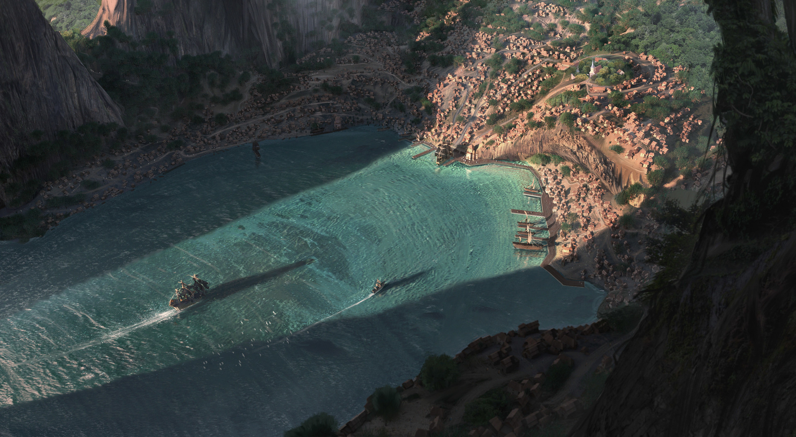

<h1 align="center">Welcome to The Poets Bay!</h1>

 
<h3 align="center">A place for poets to share their work and get feedback from other users.</h3>

## Some of the features we have:
- User login.
  - Email and password authentication.
- Poem creation :pencil2:.
- Rating system for poems.
  - Comments on poems.
  - Editing your own comments.
- User profile page.
  - Editing your own profile.

---

<h2 align="center">Description</h2>

* The Poets Bay is a website where users can share their poems and get feedback from other users. As a project for the Programación I at the "Universidad de Mendoza", we were tasked with creating a website using Flask and MYSQL. The Poets Bay is the result of that project. My name is Alexis Lino and I am the creator of this website. I hope you enjoy it!
  
  
---

<h2 align="center">Contact information</h2>

*  [Instagram](https://www.instagram.com/alex.linoo/)
*  [Twitter](https://twitter.com/AlexisLino19)

